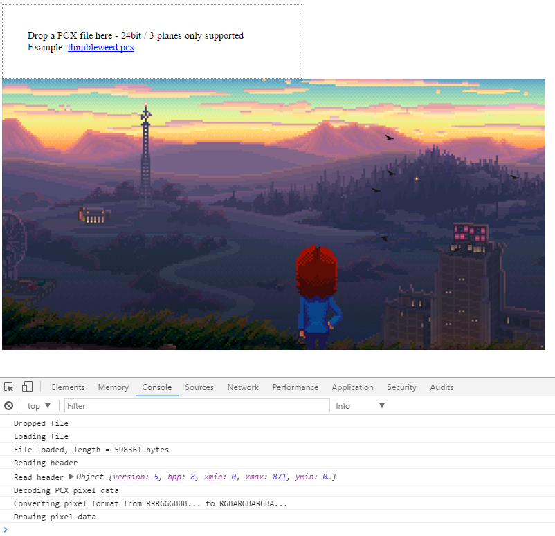

# pcx-js - loading and decoding pcx files using JavaScript

This is just a little attempt at writing a very simple [PCX](https://en.wikipedia.org/wiki/PCX) decoder for JavaScript.

This loader only supports 24bit (3 planes) PCX files.

## Demo

Head over to [https://warpdesign.github.io/pcx-js/](https://warpdesign.github.io/pcx-js/) for a demo.

## How to use it?

Simply open the html file and drop a local PCX file onto the drop zone and it
will be decoded:



## PCX file format

PCX file format is quite simple.

Every PCX file starts with the magic word `10` (0xA) and is followed by a version number from 1 to 5.

The header is 128 bytes long and can contain an optional 16 colors palette:

| Offset        | Size (bytes)  | Description                 |
| ------------- |:-------------:| ---------------------------:|
| 0             | 1             | PCX magic word              |
| 1             | 1             | PCX version                 |
| 2             | 1             | Encoding (0x1 == RLE)       |
| 3             | 1             | bitsPerPlane                |
| 4             | 2             | Xmin                        |
| 6             | 2             | Ymin                        |
| 8             | 2             | Xmax                        |
| 10            | 2             | Ymax                        |
| 12            | 2             | Horizontal resolution (dpi) |
| 14            | 2             | Vertical resolution (dpi)   |
| 16            | 48            | 16 color palette            |
| 65            | 1             | bitplanes                   |
| 66            | 2             | bytesPerRow                 |

The width and height of the image is given by `Xmax - Xmin + 1` and the size of a scanline is give by `width * bytesPerRow`.

*Note* Since `bytesPerRow` is always even, there may be an optional marker at the end of each plane.

## PCX RLE encoding

PCX uses a quite simple encoding called RLE (`Run-length encoding`) which is a lossless data compression in which several consecutive pixels of the same color are grouped in a sequence. Instead of saving each pixel, RLE saves the count and then the value that needs to get repeated.

Let's imagine a picture with the following colors:

```
0x5 0x10 0x10 0x10 0x10 ...
```

The encoded RLE data would look like this:

```
0x5 0xC4 0x10 ...
```

The first pixel is not repeated so appears decoded. For the next one, we have to repeat it 4 times. To do so, we have to create a new byte with the PCX marker `0xC0` (2 most significant bits are set to 1: `1100000000` in binary) and mask it with the repeat count:

```
0xC0 | 0x4 == 0xC4
```

The next byte is then pixel value that we want to repeat: `0x10`.

## PCX 24bit pixel format vs HTML Canvas

Each PCX scanline is divided into RGB `planes` (there may be an optional third plane for luminance or alpha but this is not supported). For example, a 4x4 pixels 24bit file would look like this:

```
row 1
RRRR
GGGG
BBBB

row 2
RRRR
GGGG
BBBB

row 3
RRRR
GGGG
BBBB

row 4
RRRR
GGGG
BBBB
```

HTML Canvas uses the following `RGBA` pixel format and stores each pixel consecutively, so the previous 4x4 24bit file would be encoded like this in Canvas' pixel format:

```
row 1
RGBA RGBA RGBA RGBA
row 2
RGBA RGBA RGBA RGBA
row 3
RGBA RGBA RGBA RGBA
row 4
RGBA RGBA RGBA RGBA
```

 - PCX.decode both decodes RLE pixel data and convert it into HTML Canvas RGBA format.

 ## Rendering using Canvas

 Drawing pixel onto the screen is as simple as calling `CanvasContext.putImageData` and feeding it with an array of RGBA data.

 `CanvasContext.createImageData` takes care of allocating the memory for writing pixel data.

 ## Working on binary data using JavaScript

 Since a few years, JavaScript provides an easy way to work with binary Data using the `ArrayBuffer` and `TypedArray` objects.

 And most filesystem APIs like the FileReader API have been updated to work with it:

 ```javascript
 var reader = new FileReader();
        
reader.onload = (e) => {
    // An array buffer is a simple binary buffer
    let buffer = e.target.result;
    
    // To access it we simple create a TypedArray view
    let byteView = new Uint8Array(e.target.result);
    
    // now we may read/write on the buffer using the typedArray:
    byteView[0] = 0x24;

    // The neat thing is that much like with C pointers, you may
    // have several views pointing to the same buffer:
    // create a Word view on the same buffer
    let wordView = new Uint16Array(e.target.result)
    wordView[0] = 0x2435;
}

reader.readAsArrayBuffer(file);
```

## What's missing

This was a simple experiment and does not support any paletted PCX files nor files using a transparency channel.